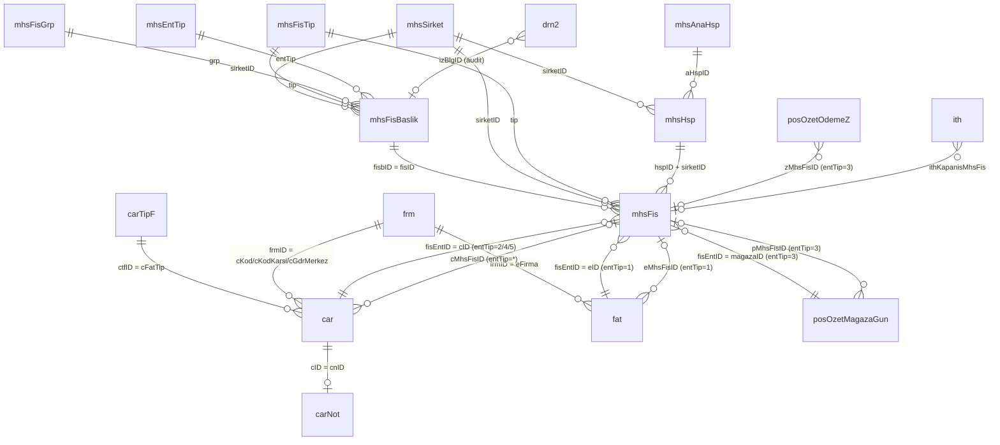

# Muhasebe Modülü — Canlı Tablo Şeması ve Enum Dağılımları

> **Veritabanı:** `DerinSISBkm` (192.168.40.201)
> **Çekim tarihi:** 11.05.2026
> **Kaynak SP'ler:** [`01-mhsFis_sil-kaynak.sql`](./01-mhsFis_sil-kaynak.sql), [`03-mhs-CRUD-sp-kaynak.sql`](./03-mhs-CRUD-sp-kaynak.sql)

Bu belge `mhs.mhsFis_sil` ve CRUD prosedürleriyle dokunulan **TÜM** tabloların
canlı şemasını, FK haritasını, satır sayılarını ve enum lookup'larını tek
yerde birleştirir.

---

## 1. Tablo Envanteri — Tek Bakış

| Tablo | Schema | Satır | Rolü | PK |
|---|---|---:|---|---|
| **mhsFisBaslik** | mhs | 15.278.129 | Fiş başlığı (master) | `fisbID` |
| **mhsFis** | mhs | 39.471.113 | Fiş detayı / mahsup satırları | `fsID` (identity) |
| **mhsSirket** | mhs | 6 | Mali şirket / dönem | `sirketID` |
| **mhsHsp** | mhs | 24.429 | Hesap planı (per-şirket) | `(hspID, hspSirketID)` |
| **mhsAnaHsp** | mhs | ≥10 | Ana hesap kategorileri | `aHspID` |
| **mhsEntTip** | mhs | 6 | Entegrasyon tipi enum | `entTipID` |
| **mhsFisTip** | mhs | 4 | Fiş tipi enum | `mhsFisTipID` |
| **mhsFisGrp** | mhs | 1 | Fiş grubu enum (BKM'de tek değer) | `fisGrpID` |
| **sil.mhsFis** | sil | 759.326 | Silinen fişler arşivi | _PK yok_ |
| **fat** | dbo | 7.040.328 | Fatura | `eID` |
| **car** | dbo | 23.678.087 | Cari hareket | `cID` |
| **carNot** | dbo | 20.751 | Cari hareket notu | `cnID` (FK→car.cID) |
| **carTipF** | dbo | 73 | Cari hareket tipi (cFatTip enum) | `ctfID` |
| **ith** | dbo | 0 | İthalat/İhracat dosyası (BKM'de boş) | `ithID` |
| **posOzetMagazaGun** | dbo | 5.411 | POS günlük mağaza özeti | `(magazaID, satisTarih)` |
| **posOzetOdemeZ** | dbo | 21.759 | POS Z raporu ödeme detayı | _PK yok, identity zID_ |
| **drn2** | dbo | 59.138.551 | Audit / denetim izi | `izID` |

**Notlar:**
- `mhs.mhsFis` (39M) detay, `mhs.mhsFisBaslik` (15M) master → ortalama 2.6
  satır/fiş. Mahsup pratikte 2 satır (borç + alacak), bazen daha fazla.
- `mhs.mhsHsp` PK **composite** — aynı hesap kodu (örn. `100.10 KASA`) her
  şirket için ayrı satır. BKM'de 6 şirket var → ~4070 unique hesap × 6 ≈ 24K.
- `dbo.ith` 0 satır → BKM ithalat/ihracat operasyonu yapmıyor. SP'deki
  ith koruma blokları **defansif**, pratikte tetiklenmiyor.
- `dbo.drn2` 59M satır — BKM'deki tüm modüllerin audit log'u burada toplanıyor.

---

## 2. Çekirdek Tablolar — Detay

### 2.1 `mhs.mhsFisBaslik` — Fiş başlığı (master)

| Kolon | Tip | Notu |
|---|---|---|
| `fisbID` | int IDENTITY PK | Fiş ID (detayda `fisID` olarak refere) |
| `fisbSirketID` | tinyint | → `mhsSirket.sirketID` |
| `fisAd` | varchar(50) | Fiş başlık metni |
| `yevmiyeNo` | int | Şirket içinde sıralı (max+1, race riski var — bkz. `mhsSonYevmiyeNo` SP) |
| `fisTarih` | smalldatetime | Fiş tarihi |
| `fisTip` | tinyint | → `mhsFisTip` (0=Tahsil, 1=Tediye, 2=Mahsup, 3=Yansıtma) |
| `fisGrp` | tinyint | → `mhsFisGrp` (BKM'de hep 0=Genel) |
| `fisEntTipID` | tinyint | → `mhsEntTip` — kritik enum |
| `fiscID` | int | İlgili cari hareket ID'si (entTip=5 ithalat/ihracat'ta `car.cID`) |
| `fisOnay` | tinyint | 1=Onaylı, 0=Onay bekliyor |
| `gKisi/kKisi/oKisi` | int | Oluşturan / değiştiren / onaylayan kullanıcı |
| `gTarih/kTarih/oTarih` | smalldatetime | Sistem tarih damgaları |
| `fisZmi` | tinyint | _Bilinmiyor — sample veriye bakmalı_ |

**FK'lar:** `fisbSirketID→mhsSirket`, `fisTip→mhsFisTip`, `fisGrp→mhsFisGrp`, `fisEntTipID→mhsEntTip`

**Kritik index'ler:**
- `IX_mhsFisBaslik_fisbSirketID_yevmiyeNo` → yevmiye no sorgularında
- `IX_mhsFisBaslik_EntTip` → entegrasyon tipi filtresi
- `IX_mhsFisBaslik` (clustered + 4 kolon) → genel listeleme

### 2.2 `mhs.mhsFis` — Detay (mahsup satırları)

| Kolon | Tip | Notu |
|---|---|---|
| `fsID` | int IDENTITY PK | Detay satır ID |
| `fisID` | int | → `mhsFisBaslik.fisbID` (FK var) |
| `fisSirketID` | tinyint | Master ile aynı (denormalize) |
| `yevmiyeNo` | int | Master ile aynı (denormalize) |
| `fisTarih` | smalldatetime | Master ile aynı (denormalize) |
| `fisTip` | tinyint | Master ile aynı (denormalize) |
| `fisBA` | tinyint | 0=Borç, 1=Alacak ?? — sign convention birbiriyle çelişiyor (bkz. ⚠️) |
| **`fisTutar`** | decimal(15,2) | **SIGNED** — negatif = Borç, pozitif = Alacak (mhsFis_vw'den teyit) |
| `fisEntID` | int | Entegrasyon kaynak ID (entTip=1 için fat.eID, entTip=2/4 için car.cID, entTip=3 için magazaID) |
| `fisHspID` | int | → `mhsHsp.hspID` (FK composite ile fisSirketID birlikte) |
| `fisAciklama` | varchar(50) | Satır açıklaması |
| `fisGdrMerkez` | int | Gider merkezi (cost center) ID |
| `fisCari` | tinyint | Cari ile ilgili boolean (0/1) |
| `fisTutarDvz` | decimal(20,4) | Dövizli tutar (signed) |
| `fisDvzID` | tinyint | 1 = TL (Borç/Alacak dövizi sıfır), >1 = döviz |

**FK'lar:** `fisID→mhsFisBaslik.fisbID`, `(fisHspID, fisSirketID)→mhsHsp(hspID, hspSirketID)`, `fisTip→mhsFisTip`, `fisSirketID→mhsSirket`

**⚠️ `fisBA` vs `fisTutar` paradoksu:**
- `mhsFis_vw` *sadece* `fisTutar`'ın işaretine bakıyor (negatif=Borç,
  pozitif=Alacak), `fisBA`'yı kullanmıyor.
- Yani kayıt eklerken aslında her ikisi de doldurulmalı ama gerçek
  hesaplamada `fisTutar` belirleyici.
- `fisBA` muhtemelen "kullanıcının seçtiği yön" (UI'da Borç/Alacak butonu),
  `fisTutar` ise hesaplanmış işaretli değer.
- **Doğrulama gerek:** `SELECT fisBA, SIGN(fisTutar), COUNT(*) GROUP BY` ile.

### 2.3 `mhs.mhsSirket` — Mali şirket / dönem

6 satır. BKM'nin mali yapısı şu 6 şirketi içeriyor (sample veriye bakmalı).

Önemli alanlar:
- `sirketSiraliTarih` — bu tarihten önceki fiş silinemez (mali kapanış)
- `sirketIlkFisID` / `sirketSonFisID` — açılış/kapanış fişi referansları
- `sirketEntegre` (default 1) — şirket entegre çalışma modunda mı
- `sirketEnt*` (20+ flag) — fatura/cari/POS otomasyon flag'leri
  (sirketEntOtoFat, sirketEntOtoCar, sirketEntOtoPos vs.)

→ `sil.mhsFis` SP'sinin ilk SELECT'inde sirketSiraliTarih bu tablodan geliyor.

### 2.4 `mhs.mhsHsp` — Hesap planı (per-şirket)

```
hspID (identity, ama PK'nın sadece bir parçası)
hspSirketID  ← PK'nın diğer parçası
hspAnaID     → mhsAnaHsp.aHspID (1=Dönen Varlıklar, 6=Gelir Tablosu vs.)
hspKod       varchar(20)   — TDHP kodu (örn. "100.10.001")
hspAd        varchar(100)  — örn. "Merkez TL.Kasa"
hspTur       tinyint       — _hesap türü (kategori) — incelenecek_
hspGdrYontem tinyint       — gider dağıtım yöntemi
hspGdrOndeger int          — varsayılan gider merkezi
```

**Gözlem (sample data):** aynı `hspKod` (`"100.10"` KASA) **her şirket için
ayrı satır** (hspID 5986, 6508, 10036, 13870, 18414, 23286). Yani 6 şirket
için 6 kopya. UNIQUE index `mhsHspKodIx (hspSirketID, hspKod)` bunu garanti
ediyor.

### 2.5 `mhs.mhsAnaHsp` — Ana hesap kategorileri

```
aHspID    aHspAd                       aHspTur  aHspBA
   1      Dönen Varlıklar                   0       1
   2      Duran Varlıklar                   0       1
   3      Kısavadeli Yabancı Kaynaklar      0       1
   4      Uzun Vadeli Yabancı Kaynaklar     0       1
   5      Özkaynaklar                       0       1
   6      Gelir Tablosu Hesapları           0       1
   7      Maliyet Hesapları                 0       1
   9      Nazım Hesaplar                    0       1
  10      Hazır Değerler                    0       1
  11      Menkul Kıymetler                  0       1
```

→ Klasik TDHP ana grupları (8 = Serbest atlanmış).

---

## 3. ENUM Sözlüğü (canlı veriden)

### 3.1 `mhs.mhsEntTip` — Entegrasyon tipleri

| ID | Ad | Pratikte adet (BKM 2021-2026) | SP'deki davranış |
|---:|---|---:|---|
| 0 | **Kullanıcı** | 1.369 | Manuel mahsup; SP'de özel blok yok |
| 1 | **Fatura** | **7.027.673** | `fat.eMhsFisID=0` + `car.cMhsFisID=0` (cFatTip<13) |
| 2 | **Cari** | **8.225.342** | `car.cMhsFisID=0` (cID/cBag eşleşen) |
| 3 | **POS** | 23.745 | Mağaza-gün ana fişi; cascade Z + diğer kasa silme |
| 4 | **Mağaza Kasası** | **0** | SP'de entTip 2,4 birlikte; **BKM'de hiç tetiklenmemiş** |
| 5 | **Cari Fiş** | **0** | SP'de cFatTip 20-199 carNot/car silme; **BKM'de hiç tetiklenmemiş** |

**🔍 Operasyonel resim:** BKM muhasebesinin **%99.8'i Cari (2) + Fatura (1)
entegrasyonu**. POS ve manuel toplam %0.2. Mağaza Kasası ve Cari Fiş
entegrasyonları **hiç açılmamış** — SP'deki o bloklar ölü kod (defansif
ama tetiklenmiyor).

### 3.2 `mhs.mhsFisTip` — Fiş tipleri

| ID | Ad | Yansıtma flag | Pratikte adet |
|---:|---|---:|---:|
| 0 | Tahsil | 0 | 31 |
| 1 | Tediye | 0 | 1 |
| 2 | **Mahsup** | 0 | **15.278.097** |
| 3 | Yansıtma | 0 | 0 |

→ BKM virtually her şeyi "Mahsup" tipinde yapıyor. Tahsil/Tediye/Yansıtma
neredeyse hiç. Bu, "tüm muhasebe entegrasyon kaynaklı" yorumuyla tutarlı.

### 3.3 `mhs.mhsFisGrp`

Tek satır: `0 = Genel`. Bu kolonun BKM'de pratik anlamı yok.

### 3.4 `dbo.carTipF` — Cari hareket tipi (cFatTip enum)

73 satır var. SP'deki kritik aralıklar canlı verilen anlamlandı:

| Aralık | Anlamı | Örnek tipler |
|---|---|---|
| **0-12** (cFatTip < 13) | **Fatura kaynaklı** cari hareketler | 0=Alış, 1=Satış (6.65M), 2=Alış İade, 3=Satış İade (165K), 4=Mağaza Satış, 5=Mağaza Satış İade, 6=Hizmet, 7=Gider (36K), 8/9=Fiyat Farkı, 10=İade Fark, 11/12=Satış Fiyat Farkı |
| **13** | Gider Ödemesi | Tek tip — POS kasa fişi olarak SP'de özel handling |
| **14-19** | Karma | 14=Banka Teslim, 15=Kasiyer Ödemesi (POS kasası), 18=Sat-Öde, 19=KDV'li Cari İşlem |
| **20-99** | Karma — kasa, çek, virman | 20=Kur Farkı, 30=Gelen Havale, 33=Faiz, 40=Kredi, 41=Fon, 43=Bankaya Yatan, 44-46=Avans, 70=İş Avansı, 95=KK İptal, 97=Çek, 99=Devir |
| **100-139** | **Ödeme tipleri** | **100=Nakit (2.39M)**, 101=Havale, 102=Virman, **103=Kredi Kartı (13.24M)** ← en yoğun, 104=EFT, 110=İthalat Gideri, 111=Banka Masraf, 112-128=Belge tipleri (Makbuz/Dekont/Slip/Yazar Kasa Fişi/Banka Ekstresi 803K), 129-139=Tahakkuklar |
| **200-222** | **Çek hareketleri** | 200=A.Çek Portföyde, 201=A.Çek Ciro, 202=A.Çek Tahsil, 203=A.Çek İade, 220=V.Çek Ödeme, 221=V.Çek Tahsil, 222=V.Çek İade |

**SP'deki `cFatTip BETWEEN 20 AND 199` aralığı:** entTip=3 (POS) ve entTip=5
(İth/İhr) durumlarında bu aralıktaki cari hareketler ya temizlenir ya
silinir. Yani **tüm kasa/banka/çek/ödeme hareketleri**.

**`carTipF` ek alanları:**
- `ctfMagazaKasa` — POS mağaza kasasında çıkan tipler (15, 95, 100, 103, 117)
- `ctEdefter` — e-Defter belge tipi mapping (0,1,2,5,6 — XML schema)
- `ctOdeme` — sadece 95 (KK İptal) için 1
- `ctfVirman` — BKM'de hep 0

### 3.5 `dbo.drn2.izProgID` — Audit modül kodları

SP'lerden gözlenenler:
- **55** → `mhs` (muhasebe modülü)
- **11** → `car` (cari modülü)

(Diğer modül kodları — incelenecek; kullanılmıyor olabilir.)

### 3.6 `dbo.drn2.islem` — Audit operasyon kodları

CRUD + onay SP'lerinden derlenen sözlük:

| islem | Anlam | Hangi SP |
|---:|---|---|
| 2 | Kaydet (insert) | `mhsFisB_ekle` (yeni fiş) |
| 3 | Değiştir (update) | `mhsFisB_ekle` (mevcut fiş güncelleme) |
| 4 | Sil | `mhsFis_sil` |
| 5 | Onay (`@onay=1`) | `mhsFis_onay` |
| 6 | Onay kaldır (`@onay=0`) | `mhsFis_onay` (5+(1-0)=6) |

---

## 4. FK Haritası — Mermaid



---

## 5. SP Açık Sorularına Karşılaştırma

| 02 dosyasındaki soru | Şu anki cevap |
|---|---|
| 1. fisEntTipID değerleri tam liste? | ✅ 0-5 (Kullanıcı/Fatura/Cari/POS/Mağaza Kasası/Cari Fiş). 6+ yok. |
| 2. mhsFis vs mhsFisBaslik ilişkisi? | ✅ FK ile 1:N. Master `fisbID` = Detay `fisID`. Her başlık için N detay satırı. |
| 3. cFatTip kodları tam liste? | ✅ 73 tip; `dbo.carTipF` lookup. Aralık anlamları netleşti. |
| 4. fisHspID lookup tablosu? | ✅ `mhs.mhsHsp` (24K), composite PK (hspID + hspSirketID). Detayda. |
| 5. fiscID ne? | ✅ "Fiş cari ID" — entTip=5'te ilgili cari hareketin master ID'si (bkz. SP fiscID kullanımı). |
| 6. drn2.izProgID kodları? | 🟡 Kısmen — 55=mhs, 11=car. Diğerleri keşfedilecek. |
| 7. @belgeyi=0 senaryosu? | ❌ Hâlâ açık. Kim çağırıyor? Kalan master satırı orphan mı? |
| 8. Soft vs hard delete + geri yükleme? | ❌ `sil.mhsFis` arşiv var ama `mhs.mhsFis_geriYukle` SP'si var mı? Aranacak. |
| 9. POS cascade riski? | 🟡 entTip=3'te aynı tarih+mağaza her şey siliniyor — `cKod=mkn OR cKodKarsi=mkn` filtreleri var. Yanlış mağaza riski düşük ama tarihsel duplicate fiş varsa toplu silinme olabilir. |
| 10. dbo.fat schema? | ✅ `dbo`. Doğrulandı. |

---

## 6. Yeni Çıkan Açık Sorular

1. `mhsFisBaslik.fisZmi` — _bilinmiyor_, sample veriye bakmalı.
2. `mhsFis.fisBA` ile `SIGN(fisTutar)` her zaman tutarlı mı? (cross-check sorgusu lazım)
3. `mhsHsp.hspTur` — hesap türü kategorisi (varlık/borç/gelir/gider ayrımı?)
4. `mhsHsp.hspGdrYontem` — gider dağıtım yöntemi seçenekleri?
5. `mhsSirket.sirketAd` ile BKM'nin 6 mali şirketi ne? (sample data lazım)
6. `mhsFisTip.mhsFisTipYansitma` flag'i ne ifade eder (hep 0 değerinde)?
7. `mhs.mhsFis_geriYukle` veya benzeri bir restore SP var mı? (`sil.mhsFis`'ten geri çağırma)

---

## 7. Faydalı Sorgular (sonradan kullanılacak)

```sql
-- Şirketlerin fiş/yevmiye durumu
SELECT s.sirketID, s.sirketAd, s.sirketDonem,
       s.sirketSiraliTarih AS kapanis,
       COUNT(*) AS toplam_fis,
       MIN(b.fisTarih) AS ilk_fis, MAX(b.fisTarih) AS son_fis,
       MAX(b.yevmiyeNo) AS son_yevmiye
FROM mhs.mhsSirket s
LEFT JOIN mhs.mhsFisBaslik b ON b.fisbSirketID = s.sirketID
GROUP BY s.sirketID, s.sirketAd, s.sirketDonem, s.sirketSiraliTarih

-- Onaylanmamış fiş (workflow bekleyenler)
SELECT b.fisbID, b.fisTarih, b.yevmiyeNo, b.fisAd, b.fisbSirketID
FROM mhs.mhsFisBaslik b
WHERE b.fisOnay = 0

-- Bir fişin tam mahsup tablosu (Borç/Alacak ayrımıyla)
SELECT fisID, yevmiyeNo, fisTarih, hspKod, hspAd,
       Borc, Alacak, fisAciklama
FROM mhs.mhsFis_vw
WHERE fisID = ?
ORDER BY fsID

-- Bir fişin denge kontrolü (Borç toplam = Alacak toplam ?)
SELECT fisID,
       SUM(CASE WHEN fisTutar < 0 THEN -fisTutar ELSE 0 END) AS borc_top,
       SUM(CASE WHEN fisTutar > 0 THEN  fisTutar ELSE 0 END) AS alacak_top,
       SUM(fisTutar) AS net  -- 0 olmalı
FROM mhs.mhsFis
GROUP BY fisID
HAVING SUM(fisTutar) <> 0
```
